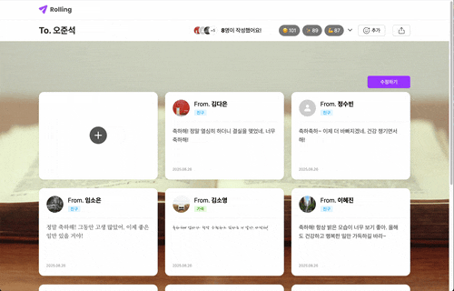
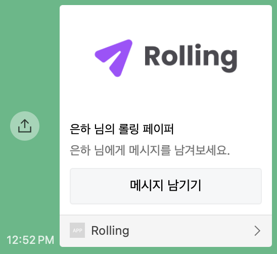
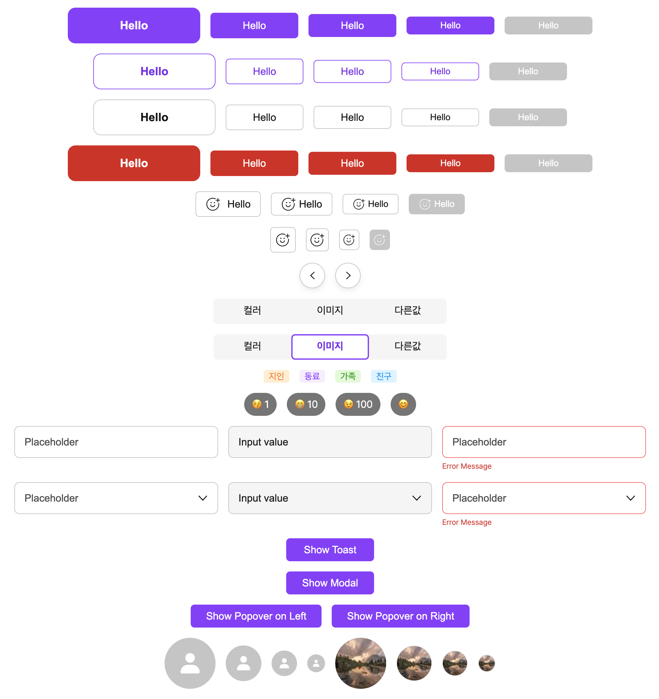
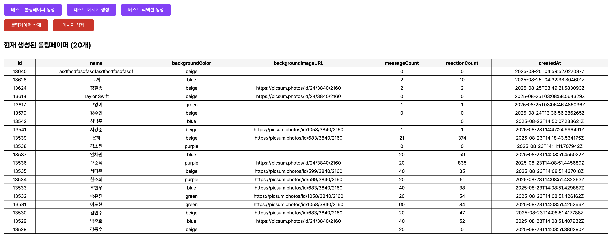

# Rolling: 롤링 페이퍼 커뮤니티 플랫폼

## 소개

- 코드잇 스프린트 프론트엔드 과정에 18기로 참여하고 진행한 첫 번째 팀 프로젝트
- 의도적으로 배우지 않은 기술과 외부 라이브러리 사용을 최대한 자제하고 **학습한 기술들의 숙련도 향상**에 초점을 맞추어 진행

## 기술스택

| 분류 | 내용 | 비고 |
| --- | --- | --- |
| UI | React Styled-Components | |
| Routing | React Router | |
| Network | Axios | Fetch API를 활용하여 공통 네트워크 모듈을 개발하는 대신 팀원들에게 더 익숙한 axios 사용 |
| Bundling | Vite | |
| Deploy | Vercel | 향후 학습할 Next.js와 관련된 배포 환경을 미리 체험해 보기 위해 Vercel로 배포 진행 |
| Library | React Quill New Emoji Picker React | 개발 시간 단축을 위해 외부 라이브러리 사용 |

## 참고 자료

### 공식 문서

- [MDN | Clipboard API](https://developer.mozilla.org/ko/docs/Web/API/Clipboard_API)
- [MDN | IntersectionObserver API](https://developer.mozilla.org/ko/docs/Web/API/Intersection_Observer_API)
- [MDN | Window: matchMedia() method](https://developer.mozilla.org/en-US/docs/Web/API/Window/matchMedia)
- [MDN | Element: getBoundingClientRect() method](https://developer.mozilla.org/en-US/docs/Web/API/Element/getBoundingClientRect)
- [React | createPortal](https://react.dev/reference/react-dom/createPortal)
- [Vite | Vite의 환경 변수와 모드](https://ko.vite.dev/guide/env-and-mode)
- [GitHub | Using secrets in GitHub Actions - use using secrets in a workflow](https://docs.github.com/en/actions/how-tos/write-workflows/choose-what-workflows-do/use-secrets#using-secrets-in-a-workflow)

### 블로그

- [GitHub Actions의 pull_request_target과 workflow_run 이벤트](https://blog.outsider.ne.kr/1541)
- [React portal을 활용한 드롭다운 컴포넌트 구현하기](https://ji-hoon.github.io/blog/implement-dropdown-with-react-portal)
- [React component: 마운트 될 때와 언마운트 될 때 각기 다른 애니메이션 적용하기](https://seo-tory.tistory.com/73)
- [setTimeout없이 애니메이션이 끝날 때 컴포넌트 언마운트 시키기 (feat. FSM, animation event)](https://ianlog.me/blog/modal-atoz/alert-dialog-animation)
- [Vercel로 Organization 레포지토리 무료 배포하기](https://velog.io/@woogur29/Organization-%EB%A0%88%ED%8F%AC%EC%A7%80%ED%86%A0%EB%A6%AC-vercel%EB%A1%9C-%EB%AC%B4%EB%A3%8C-%EB%B0%B0%ED%8F%AC%ED%95%98%EA%B8%B0)

## 담당 역할 및 개발 내용

### 프로젝트 설정 및 협업

- GitHub repository의 branch ruleset 설정
    - Direct push 및 force push 금지
    - Branch 삭제 금지
    - PR merge를 위한 approve 조건 설정 (최소 2명)
- Pull request 관련 알림을 위한 discord webhook 연동 및 설정
- 모든 팀원들이 일관된 형식으로 PR을 작성하기 위한 [PR template](https://github.com/codeit-FE-18-part2/rolling/blob/develop/.github/pull_request_template.md) 추가
- 작업 종류에 따라 일관된 issue를 작성하기 위한 5가지 [issue template](https://github.com/codeit-FE-18-part2/rolling/tree/develop/.github/ISSUE_TEMPLATE) 추가
- PR 생성 시 자동으로 reviewer를 추가하기 위한 '[auto assign  app](https://github.com/codeit-FE-18-part2/rolling/blob/develop/.github/auto_assign.yml)' 설정
- GitHub [issue](https://github.com/codeit-FE-18-part2/rolling/issues)와 [project board](https://github.com/orgs/codeit-FE-18-part2/projects/1)를 활용한 할 일 및 일정 관리 방식 수립
- GitHub [WiKi](https://github.com/codeit-FE-18-part2/rolling/wiki)를 활용하여 프로젝트 규칙, 참고자료 등 문서화
- 팀원들이 생성한 PR의 코드 리뷰 ([예시 1](https://github.com/codeit-FE-18-part2/rolling/pull/23#discussion_r2271472628), [예시 2](https://github.com/codeit-FE-18-part2/rolling/pull/23#discussion_r2277835736), [예시 3](https://github.com/codeit-FE-18-part2/rolling/pull/54#discussion_r2281056746))

### 배포

- 배포 환경에 따라 다르게 사용될 값을 환경 변수 파일로 관리
- 배포 자동화를 위한 [GitHub Actions workflow](https://github.com/codeit-FE-18-part2/rolling/tree/develop/.github/workflows) 작성
    - Vercel은 organization repository에 대해 유료 plan을 사용해야 하므로 forked repository를 배포용 repository로 사용
    - Upstream repository의 `develop` branch에 commit이 push 또는 merge되면 forked repository로 push하는 workflow 작성
    

### 개발

#### `IntersectionObserver`를 활용한 무한 스크롤 구현 ([관련 PR](https://github.com/codeit-FE-18-part2/rolling/pull/82))

- 구현 방식
    1. 서버에 첫 번째 page의 데이터를 요청하고 render
    2. List의 끝까지 스크롤하면 서버에 다음 page의 데이터를 추가 요청
    3. 다음 page 데이터를 `useState`가 반환하는 setter를 통해 이전 state에 이어붙이고 component를 re-render
- `IntersectionObserver` API 활용
    1. List 맨 아래에 observing을 위한 `
` 요소를 추가
    2. 이 요소를 `IntersectionObserver`가 observe
    3. 요소가 viewport에 들어오거나 나갈 때마다 callback 실행
    4. Observer callback으로 받는 `IntersectionObserverEntry`의 `isIntersecting` 값이 `true`일 때 다음 page 데이터 요청
- React component에서 사용하기 위해 [`useIntersectionObserver` custom hook](https://github.com/codeit-FE-18-part2/rolling/blob/develop/src/hooks/use-intersection-observer.jsx)으로 구현

#### React portal을 활용하여 컴포넌트를 별도의 layer에 render ([관련 PR](https://github.com/codeit-FE-18-part2/rolling/pull/56))

- Portal : React component tree 구조는 유지하면서도 DOM tree 상에 임의의 위치에 component를 render 해 주는 것
- Dropdown, Modal, Popover 등 화면 전체를 덮어야 하는 component를 portal을 활용해서 별도의 layer에 render
- 구현 방식
    1. React Context API를 활용해서 component를 portal로 render할 수 있는 scope를 제공하는 [`PortalProvider` component](https://github.com/codeit-FE-18-part2/rolling/blob/develop/src/components/portal/portal-provider.jsx) 구현
    2. Portal로 rendering할 요소를 결정하는 [`Portal` component](https://github.com/codeit-FE-18-part2/rolling/blob/develop/src/components/portal/portal.jsx) 구현
    3. Portal로 rendering할 요소의 rendering 조건을 결정하는 [`usePortal()` custom hook](https://github.com/codeit-FE-18-part2/rolling/blob/develop/src/hooks/use-portal.jsx) 구현
    4. Portal로 rendering한 component의 mount/unmount를 animation의 시작/끝 시점과 동기화 시키기 위한 [`useAnimatedPortal()` custom hook](https://github.com/codeit-FE-18-part2/rolling/blob/develop/src/hooks/use-animated-portal.jsx) 구현

- **구현 예시 : `Modal` component**

    

    1. `Modal` component를 `Portal` component로 감싸서 구현
    2. `Modal`을 animation과 함께 열고 닫기 위해 `useAnimatedPortal()` custom hook을 활용한 [`useModal()` custom hook](https://github.com/codeit-FE-18-part2/rolling/blob/develop/src/hooks/use-modal.jsx) 구현

#### Component를 animation 종료 후 unmount 하는 custom hook 구현

- 

#### `matchMedia()` method를 활용하여 JavaScript에서 media query matching 감지

- 

#### 카카오톡 공유하기 기능 개발 ([관련 PR](https://github.com/codeit-FE-18-part2/rolling/pull/66))

- KakaoTalk JavaScript API를 연동하고 custom message template를 사용하여 공유하기 기능 개발
- 상용 환경과 개발 환경을 구분하여 JavaScript API key 및 template ID를 환경 변수로 관리

#### 공통 컴포넌트 개발 ([관련 issue](https://github.com/orgs/codeit-FE-18-part2/projects/1?pane=issue&itemId=123586709&issue=codeit-FE-18-part2%7Crolling%7C4))

- 프로젝트 초기에 Button, TextField 등 팀원들이 담당한 화면을 개발하기 위해 필요한 공통 컴포넌트 개발
- 공통 컴포넌트를 테스트하고 팀원들에게 기본적인 사용 방법 예시를 제공하기 위해 별도의 페이지 개발
- Storybook을 사용할 수도 있었지만, 학습한 것을 연습하는 것에 집중하기 위해 새로운 도구는 도입하지 않음

#### 테스트 데이터 관리 페이지 개발 ([관련 PR](https://github.com/codeit-FE-18-part2/rolling/pull/74))

- 개발 서버에 주입할 테스트 데이터를 생성, 조회, 삭제 등 관리하기 위한 별도의 페이지 개발
- 팀원들이 편리하게 테스트 데이터를 관리할 수 있도록 하여 API 연동 개발 시 생산성 향상에 기여함

## 새로 배운 것

- React portal
- Clipboard API
- `IntersectionObserver`
- Animation이 끝났을 때 component를 unmount 시키기

## 문제 해결

### Vercel 배포 시 root 이외 경로에 접근하면 404 error가 발생하는 문제 ([관련 PR](https://github.com/codeit-FE-18-part2/rolling/pull/58))

- 문제
    - React 프로젝트를 Vercel로 배포한 뒤, root(`/`) 이외의 경로로 접근하면 404 status error가 반환되는 문제
- 원인
    - React는 SPA이기 때문에 기본적으로 root HTML 1개만 가짐. `#root` id를 가진 요소에 JavaScript로 UI를 그리는 구조.
    - Vercel 등 정적 웹사이트 배포 서비스에 React 프로젝트를 배포했을 때, root 이외의 경로로 접근하면 해당 경로의 HTML 파일을 서버에 요청함
    - 하지만, React는 단일 HTML 파일만 가지고 있으므로 요청한 경로에 HTML 파일이 없어서 error가 발생한 것
        - React app에서 어떤 URL을 요청하면 웹 서버에 요청을 보내는게 아니라, URL 경로에 해당하는 component를 rendering 함
- 해결
    - `vercel.json` 설정 파일에서 root(`/`) 이외의 경로로 접근하면 항상 root로 redirect

## 시도해 봤지만 구현하지 못한 것

### PR 생성 시 결과물을 바로 확인하기 ([관련 PR](https://github.com/codeit-FE-18-part2/rolling/pull/59))

- 목표 : PR을 만들 때마다 Vercel에 배포해서 reviewer가 프로젝트를 실행하지 않고 결과를 확인하여 생산성을 향상
- 시도 : PR이 생성되면 Vercel CLI를 사용해서 source branch를 기준으로 Vercel에 preview 배포하는 GitHub Actions workflow 작성
- 문제 : Forked repository에서 trigger된 pull request event에 의해 실행되는 workflow는 upstream repository에 설정된 secrets variables에 접근할 수 없으므로 workflow를 실행할 수 없음
- 결과 : 
    - Forked repository를 사용하지 않는 협업 방식을 사용했다면 쉽게 구현할 수 있었음
    - 개발 중간에 upstream repository 하나만 사용하는 방식으로 변경하는 것은 투입하는 리소스에 비해 효과는 작을 것으로 판단하여 보류
    - 가능하다 하더라도, upstream repository가 조직 계정에 묶여 있어서 Vercel 배포가 어려운 상황임

## KPT 회고

### Keep

### Problem

### Try
