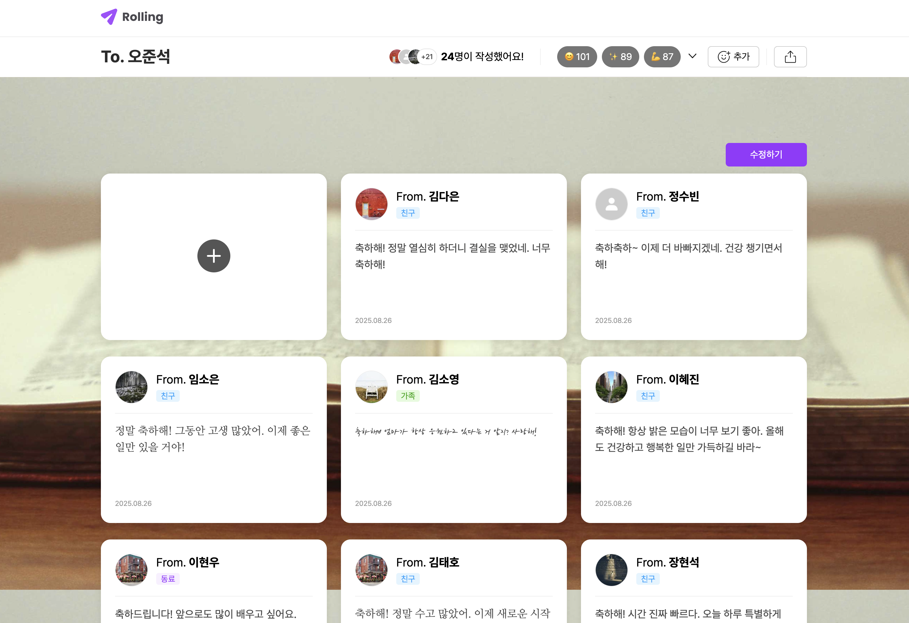
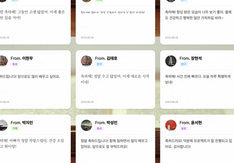

# Rolling: 롤링 페이퍼 커뮤니티 플랫폼



## 소개

- 코드잇 스프린트 프론트엔드 과정에 18기로 참여하고 진행한 첫 번째 팀 프로젝트
- 의도적으로 배우지 않은 기술과 외부 라이브러리 사용을 최대한 자제하고 **학습한 기술들의 숙련도 향상**에 초점을 맞추어 진행

### 사용 기술

- UI : React, Styled components
- Routing : React Router
- Network : Axios
    - Fetch API를 활용하여 공통 네트워크 모듈을 개발하는 대신 팀원들에게 더 익숙한 axios 사용 |
- Tool : Vite, Vercel
    - 향후 학습할 Next.js와 관련된 배포 환경을 미리 체험해 보기 위해 Vercel로 배포 진행
- Library : React Quill New, Emoji Picker React

## 담당 역할 및 개발 내용

### 프로젝트 설정 및 협업

- GitHub repository의 branch ruleset 설정
    - Direct push 및 force push 금지
    - Branch 삭제 금지
    - PR merge를 위한 approve 조건 설정 (최소 2명)
- GitHub [issue](https://github.com/codeit-FE-18-part2/rolling/issues)와 [project board](https://github.com/orgs/codeit-FE-18-part2/projects/1)를 활용한 할 일 및 일정 관리 방식 수립
- 일관된 issue 및 PR 작성을 위한 template 설정
    - [PR template](https://github.com/codeit-FE-18-part2/rolling/blob/develop/.github/pull_request_template.md)
    - [Issue templates](https://github.com/codeit-FE-18-part2/rolling/tree/develop/.github/ISSUE_TEMPLATE)
- PR 생성 시 자동으로 reviewer를 추가하기 위한 '[auto assign  app](https://github.com/codeit-FE-18-part2/rolling/blob/develop/.github/auto_assign.yml)' 설정
- GitHub [WiKi](https://github.com/codeit-FE-18-part2/rolling/wiki)를 활용하여 프로젝트 규칙, 참고자료 등 문서화
- 팀원들이 생성한 PR의 코드 리뷰 진행
    - [예시 1](https://github.com/codeit-FE-18-part2/rolling/pull/23#discussion_r2271472628)
    - [예시 2](https://github.com/codeit-FE-18-part2/rolling/pull/23#discussion_r2277835736)
    - [예시 3](https://github.com/codeit-FE-18-part2/rolling/pull/54#discussion_r2281056746)
- Pull request 관련 알림을 위한 discord webhook 연동 및 설정

### 배포

- 배포 환경에 따라 다르게 사용될 값을 환경 변수 파일로 관리
    - `.env.production` : Vite가 production mode에서 사용할 환경 변수
    - `.env.development` : Vite가 development mode에서 사용할 환경 변수
- 배포 자동화를 위한 [GitHub Actions workflow](https://github.com/codeit-FE-18-part2/rolling/tree/develop/.github/workflows) 작성
    - Vercel은 organization repository에 대해 유료 plan을 사용해야 하므로 forked repository를 배포용 repository로 사용
    - Upstream repository의 `develop` branch에 commit이 push 또는 merge되면 forked repository로 push하는 workflow 작성

### 개발

#### 공통 컴포넌트 개발 ([관련 issue](https://github.com/orgs/codeit-FE-18-part2/projects/1?pane=issue&itemId=123586709&issue=codeit-FE-18-part2%7Crolling%7C4))


- 프로젝트 초기에 Button, TextField 등 팀원들이 담당한 화면을 개발하기 위해 필요한 공통 컴포넌트 개발
- 공통 컴포넌트를 테스트하고 팀원들에게 기본적인 사용 방법 예시를 제공하기 위해 별도의 페이지 개발
- Storybook을 사용할 수도 있었지만, 학습한 것을 연습하는 것에 집중하기 위해 새로운 도구는 도입하지 않음

#### React portal을 활용하여 컴포넌트를 별도의 layer에 render ([관련 PR](https://github.com/codeit-FE-18-part2/rolling/pull/56))

- Portal : React component tree 구조는 유지하면서도 DOM tree 상에 임의의 위치에 component를 render 해 주는 것
- Dropdown, Modal, Popover 등 화면 전체를 덮어야 하는 component를 portal을 활용해서 별도의 layer에 render
- 구현 방식
    1. React Context API를 활용해서 component를 portal로 render할 수 있는 scope를 제공하는 [`PortalProvider`](https://github.com/codeit-FE-18-part2/rolling/blob/develop/src/components/portal/portal-provider.jsx) component 구현
    2. Portal로 rendering할 요소를 결정하는 [`Portal`](https://github.com/codeit-FE-18-part2/rolling/blob/develop/src/components/portal/portal.jsx) component 구현
    3. Portal로 rendering할 요소의 rendering 조건을 결정하는 [`usePortal()`](https://github.com/codeit-FE-18-part2/rolling/blob/develop/src/hooks/use-portal.jsx) custom hook 구현
    4. Portal로 rendering한 component의 mount/unmount를 animation의 시작/끝 시점과 동기화 시키기 위한 [`useAnimatedPortal()`](https://github.com/codeit-FE-18-part2/rolling/blob/develop/src/hooks/use-animated-portal.jsx) custom hook 구현
- **구현 예시 : `Modal` component**
    
    1. `Modal` component를 `Portal` component로 감싸서 구현
    2. `Modal`을 animation과 함께 열고 닫기 위해 `useAnimatedPortal()` custom hook을 활용한 [`useModal()`](https://github.com/codeit-FE-18-part2/rolling/blob/develop/src/hooks/use-modal.jsx) custom hook 구현

#### Component를 animation 종료 후 unmount 하는 custom hook 구현 ([source code](https://github.com/codeit-FE-18-part2/rolling/blob/develop/src/hooks/use-animated-mount.jsx))

- React는 component가 화면에서 사라지는 방식을 조건부 rendering으로 구현
- 닫는 animation을 추가하려면 animation이 동작하는 동안에는 component가 mount 되어 있어야 하고, animation이 끝난 뒤 unmount 해야 함
- 이것을 구현하기 위해 component에 두 가지 상태 필요
    1. Mount or unmount
    2. Show or hide (animation)
- 위 두 가지 상태를 관리하는 `useAnimatedMount()` custom hook 구현
    - `useState()`를 두 번 사용해서 두 가지 상탯값 관리
        ```javascript
        function useAnimatedMount() {
            const [isMount, setMount] = useState(false);
            const [isOpen, setOpen] = useState(false);
            ...
        }
        ```
    - Component가 animation과 함께 나타나고 사라지는 코드를 추상화한 `setShows` setter 구현
        ```javascript
        function useAnimatedMount() {
            ...
            const setShows = (shows) => {
                if (shows) {
                    // `true`를 전달하면 component를 mount하고 열리는 animation 시작
                    setMount(true);
                    setOpen(true);
                } else {
                    // `false`를 전달하면 닫는 animation 시작
                    // 이 때, `isMount`는 `true`로 component가 mount된 상태
                    setOpen(false);
                }
            };
            ...
        }
        ```
    - 닫는 animation이 종료되면 component를 unmount 시키기 위한 `onAnimatedEnd` handler 구현
        ```javascript
        function useAnimatedMount() {
            ...
            const onAnimationEnd = () => {
                // Open animation이 종료되는 경우는 무시
                if (isOpen) return;
                setMount(false);
            };
            ...
        }
        ```
    - 이 custom hook은 네 가지 값을 반환
        ```javascript
        function useAnimatedMount() {
            ...

            return { isMount, isOpen, setShows, onAnimationEnd };
        }
        ```
        - `isMount` : Component의 mount/unmount 제어 (조건부 rendering)
        - `isOpen` : Component의 open/close animation 제어
        - `setShows` : Component가 animation과 함께 나타나고 사라지는 코드 추상화
        - `onAnimationEnd` : Component에서 animation이 종료되었을 때 unmount 시키기 위한 handler

#### `IntersectionObserver`를 활용한 무한 스크롤 구현 ([관련 PR](https://github.com/codeit-FE-18-part2/rolling/pull/82))


- 구현 방식
    1. 서버에 첫 번째 page의 데이터를 요청하고 render
    2. List의 끝까지 스크롤하면 서버에 다음 page의 데이터를 추가 요청
    3. 다음 page 데이터를 `useState`가 반환하는 setter를 통해 이전 state에 이어붙이고 component를 re-render
- `IntersectionObserver` API 활용
    1. List 맨 아래에 observing을 위한 `<div>` 요소를 추가
    2. 이 요소를 `IntersectionObserver`가 observe
    3. 요소가 viewport에 들어오거나 나갈 때마다 callback 실행
    4. Observer callback으로 받는 `IntersectionObserverEntry`의 `isIntersecting` 값이 `true`일 때 다음 page 데이터 요청
- React component에서 사용하기 위해 [`useIntersectionObserver` custom hook](https://github.com/codeit-FE-18-part2/rolling/blob/develop/src/hooks/use-intersection-observer.jsx)으로 구현

#### `matchMedia()` method를 활용하여 JavaScript에서 media query matching 감지 ([source code](https://github.com/codeit-FE-18-part2/rolling/blob/develop/src/hooks/use-media.jsx))

- JavaScript에서 media query를 감지할 때 `matchMedia()` method를 사용할 수 있음
- 이 method를 React component에서 사용하기 위한 custom hook 구현
- Desktop, tablet, mobile size 변화를 감지하기 위한 `useMedia()` custom hook 구현 예시
    - 각 size 별로 `matchMedia(queryString)`을 실행하여 `MediaQueryList` 생성
        ```javascript
        function useMedia() {
            const desktop = useRef(matchMedia(mediaQueryString.desktop)).current;
            const tablet = useRef(matchMedia(mediaQueryString.tablet)).current;
            const mobile = useRef(matchMedia(mediaQueryString.mobile)).current;
            ...
        }
        ```
        - 이 때, `matchMedia()`가 생성하는 `MediaQueryList` 객체는 한 번만 생성하면 됨
        - 최초 한 번만 `MediaQueryList` 객체가 생성되도록 `useRef()` hook 사용 
    - 각 size 별로 활성화 여부를 상탯값으로 관리
        ```javascript
        function useMedia() {
            ...
            const [matches, setMatches] = useState({
                isDesktop: desktop.matches,
                isTablet: tablet.matches,
                isMobile: mobile.matches,
            });
            ...
        }
        ```
    - `useEffect()` 안에서 `MediaQueryList`에 `change` event를 감지하면 상탯값을 변경해서 component를 re-render
        ```javascript
        function useMedia() {
            ...
            useEffect(() => {
                const handleDesktopMatch = (event) => { ... };
                const handleTabletMatch = (event) => { ... };
                const handleMobileMatch = (event) => { ... };

                desktop.addEventListener("change", handleDesktopMatch);
                tablet.addEventListener("change", handleTabletMatch);
                mobile.addEventListener("change", handleMobileMatch);

                return () => {
                desktop.removeEventListener("change", handleDesktopMatch);
                tablet.removeEventListener("change", handleTabletMatch);
                mobile.removeEventListener("change", handleMobileMatch);
                };
            }, [desktop, tablet, mobile]);
        }
        ```

#### 카카오톡 공유하기 기능 개발 ([관련 PR](https://github.com/codeit-FE-18-part2/rolling/pull/66))


- KakaoTalk JavaScript API를 연동하고 custom message template를 사용하여 공유하기 기능 개발
- 상용 환경과 개발 환경을 구분하여 JavaScript API key 및 template ID를 환경 변수로 관리

#### 테스트 데이터 관리 페이지 개발 ([관련 PR](https://github.com/codeit-FE-18-part2/rolling/pull/74))


- 개발 서버에 주입할 테스트 데이터를 생성, 조회, 삭제 등 관리하기 위한 별도의 페이지 개발
- 팀원들이 편리하게 테스트 데이터를 관리할 수 있도록 하여 API 연동 개발 시 생산성 향상에 기여함

## 새로 배운 것

- React portal
- Clipboard API
- `IntersectionObserver`
- Animation이 끝났을 때 component를 unmount 시키기

## 문제 해결

### Vercel 배포 시 root 이외 경로에 접근하면 404 error가 발생하는 문제 ([관련 PR](https://github.com/codeit-FE-18-part2/rolling/pull/58))

- 문제
    - React 프로젝트를 Vercel로 배포한 뒤, root(`/`) 이외의 경로로 접근하면 404 status error가 반환되는 문제
- 원인
    - React는 SPA이기 때문에 기본적으로 root HTML 1개만 가짐. `#root` id를 가진 요소에 JavaScript로 UI를 그리는 구조.
    - Vercel 등 정적 웹사이트 배포 서비스에 React 프로젝트를 배포했을 때, root 이외의 경로로 접근하면 해당 경로의 HTML 파일을 서버에 요청함
    - 하지만, React는 단일 HTML 파일만 가지고 있으므로 요청한 경로에 HTML 파일이 없어서 error가 발생한 것
        - React app에서 어떤 URL을 요청하면 웹 서버에 요청을 보내는게 아니라, URL 경로에 해당하는 component를 rendering 함
- 해결
    - `vercel.json` 설정 파일에서 root(`/`) 이외의 경로로 접근하면 항상 root로 redirect

## 시도해 봤지만 구현하지 못한 것

### PR 생성 시 결과물을 바로 확인하기 ([관련 PR](https://github.com/codeit-FE-18-part2/rolling/pull/59))

- 목표 : PR을 만들 때마다 Vercel에 배포해서 reviewer가 프로젝트를 실행하지 않고 결과를 확인하여 생산성을 향상
- 시도 : PR이 생성되면 Vercel CLI를 사용해서 source branch를 기준으로 Vercel에 preview 배포하는 GitHub Actions workflow 작성
- 문제 : Forked repository에서 trigger된 pull request event에 의해 실행되는 workflow는 upstream repository에 설정된 secrets variables에 접근할 수 없으므로 workflow를 실행할 수 없음
- 결과 : 
    - Forked repository를 사용하지 않는 협업 방식을 사용했다면 쉽게 구현할 수 있었음
    - 개발 중간에 upstream repository 하나만 사용하는 방식으로 변경하는 것은 투입하는 리소스에 비해 효과는 작을 것으로 판단하여 보류
    - 가능하다 하더라도, upstream repository가 조직 계정에 묶여 있어서 Vercel 배포가 어려운 상황임

## KPT 회고

### Keep

- HTML/CSS/JavaScript와 React의 기초를 학습하고 있는 상황에서 외부 라이브러리를 최소로 사용하고 가능한 직접 구현해 보면서 숙련도를 높이는 데 집중한 것
- GitHub 설정, Vercel 배포, 카카오톡 공유 템플릿 제작 등 코드만 작성하지 않고 더 넓은 시야를 갖고 프로젝트를 진행한 점

### Problem

- 개발 초기에 기획 및 요구사항을 제대로 분석하지 않고 바로 개발에 들어간 점
- 그로 인해, 사용자의 관점에서 생각할 시간이 부족해지고 급하게 개발을 진행하면서 디테일한 부분을 놓친 점

### Try

- 개발을 시작하기 전에 전체적인 요구사항을 먼저 파악하고 설계하는 과정을 갖는다.
- 완벽하게 설계하기보다 먼저 대략적으로 설계한 다음 세부적인 내용을 지속적으로 개선해 나간다.